# boop.
A remake of the 2022 C++ implementation based on a deceptively cute but deceivingly challenging abstract strategy game for two players.

## Game Description
*boop.* is an abstract strategy board game where you place a kitten on the board and boops every other kitten next to the placed piece on the board one space away. Line up three kittens in a row on the board to graduate them into cat pieces, and then line up three cats in a row to win the game.

However, that isn't easy as you and the opponent are constantly booping kittens around. Can you “boop” your cats into position to win? Or will you just get booped right off the board?

### Rules
#### Contents & Set-Up
Two players begin the game with 8 kittens of their color. The 8 cats of their color begin “out of play” to the far side of the board. If playing with an AI opponent, the human player will be the first to play. Otherwise, choose the first player when playing a round of human vs. human.

#### Booping
Lining up a row of three pieces isn't easy because whenever a piece is added to the board, that piece will **boop all of its adjacent pieces** by pushing them one space away, including diagonally.

It is possible for a piece to be booped right off the board, in which case it is returned to its player's pool of pieces.

A piece that was booped does **NOT** cause a chain reaction once it moves into a new space. The other pieces it moves towards do not move away in reaction.

A **blocking** will occur if there are any two pieces already in line with a placed piece. This is true regardless of the colors of the pieces. 

Setting up a line of two and defending against it is an **important strategy**. So, breaking up or blocking your opponent's line of two is cruical to winning the game!

#### Graduating Kittens into Cats
After the booping process, the board will be scanned to see if a player has **3 kittens in a row**. Getting 3 kittens in a horizontally, vertically, or diagonally will **result in graduating those pieces into cats**.

Once the kittens are graduated into cats, those pieces are then **removed from the board** and are **permanately out of the game** as those pieces are replaced with now available cat pieces from the reserve. Remember that you will **ALWAYS** have 8 active pieces in the game.

**Alternatively**, if all 8 of your pieces are on the board, you may graduate any one kitten into a cat by removing it from the game and putting a reserved cat into your pool. You could place a cat back into your pool, instead of graduating a kitten.

In a **rare case** of lining up more than three in a row, or multiple connected 3's, **choose which group of 3 to graduate**, leaving the remaining pieces on the board. Likewise, if you have both a three in a row **AND** eight pieces on the board, **choose which you would activate**.

#### Cats
Once cats are in your active pool, you may choose to play either a cat or kitten on your turn. Cats behave the same way as kittens in all respect, expect that cats **CANNOT** be booped by kittens. However, cats **CAN** boop other cats as well as kittens.

When you line up 3 of your pieces with a **combination of cats and kittens**, you still remove all three pieces from the board and graduate any kittens. The cats in the group will go back into the pool, as do any newly graduated cats.

#### Winning
When you line up **three of your cats in a row** horizontally, vertically, or diagonally, you win the game. **Alternatively**, a player can win the game by having all 8 of their cat pieces on the board at the end of a turn.

## Features
* Booping Pieces 
* Kitten Graduation
* Human vs. Human
* Human vs. AI

## Project Structure
```
boop/
├── app/
│   └── main.cc
├── docs/
│   └── Boop_Rules.pdf
├── include/
│   ├── boop.h
│   ├── colors.h
│   └── game.h
├── src/
│   ├── boop.cc
│   ├── game.cc
├── Makefile
└── README.md
```

## Installation & Setup
### Prerequisites
* C++17 or later
* CMake
* GCC
### Installation
```
git clone git@github.com:braeden-rodgers/boop.git
cd boop
make
```
### Running the Game
```
make run
```
or 
```
./build/boop
```

## Usage
* Launch the executable 
* Follow the prompts on-screen to start a game
* Players alternate turns placing pieces
* The game ends when a win condition is met

### Controls
* All user input is handled via terminal
* Invalid moves are rejected/ignored until a player enters a valid input

## AI
WORK IN PROGRESS...

## Testing
WORK IN PROGRESS...

### Running the Tests
`make test`

## Screenshots
### Starting the Game
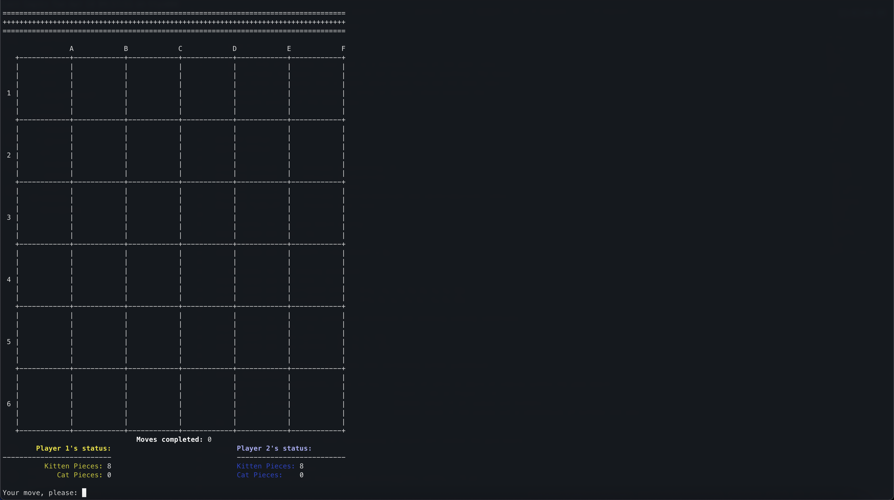
An empty game board will be displayed in the terminal upon executing the program. Each player **always** start the game with **8 active kittens** and must graduate them into cats by **placing 3 kittens in a line** so that either one of them wins the game using cats.

### Placing Kittens
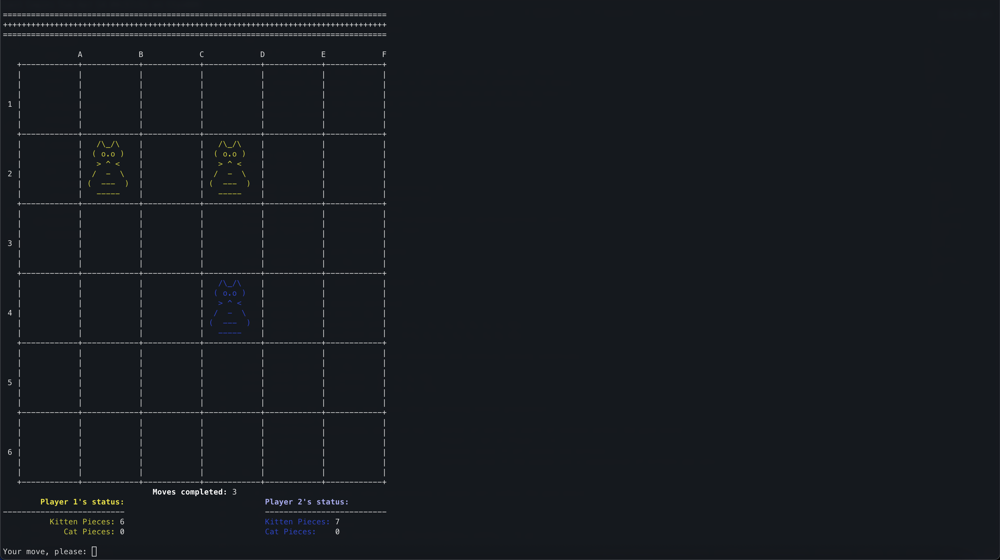
Each player places their kittens on the board by **entering their desired column letter (A-F) and then their row number (1-6)**. In this example, player 1 starts the game by placing their first kitten in cell D2, second turn with player 2 placing their first kitten in cell D4, and then player 1 placing their second kitten in cell B2. Note that **the program handles case sensitivity** when it comes to column letters, so the players can enter column letters regardless of it. Additionally, the players **cannot** place their pieces in cells that are occupied, so the game will prompt them to enter their preferred location until they come up with a valid input.

Furthermore, **booping** will occur once a kitten is placed on the board and there are adjacent pieces. Each adjacent piece will move one space away from the placed kitten. However, a kitten **cannot** boop cats nor an adjacent kitten whose next space is already occupied, which is known as **blocking**.

### Placing Cats
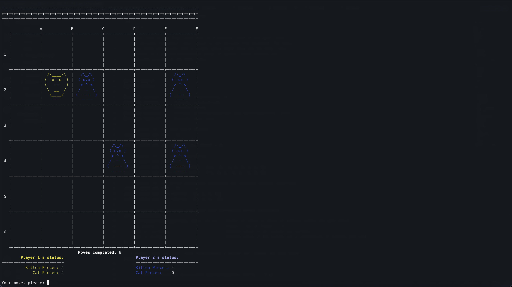
Once you line up 3 pieces on the board, those pieces will be graduated into 3 cats. Whenever you have the opportunity to place a cat on the board, the program will prompt if you would like to place one on the board. 

Cats behave the same way as kittens in terms of booping, however, cats **can** boop other cats.

### Graduation
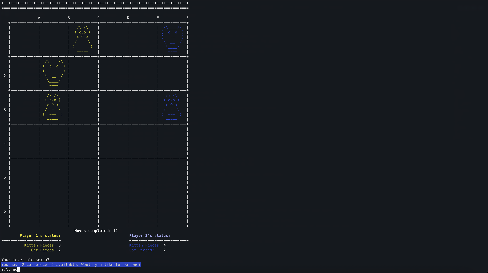
In order to graduate kittens into cats so that a player can win the game, a player **must** line up 3 kittens in a row. Lining up kittens will result in the 3 kittens turning into cats. Once kittens are graduated, the pieces are removed from the board and no longer usable as 3 cats are pulled into the pool from the reserve. Furthermore, it is possible for a player to line up their pieces that are a mix of kittens and cats. In this example, the cat in the graduation group is put back into the pool while the kittens are graduated into cats.

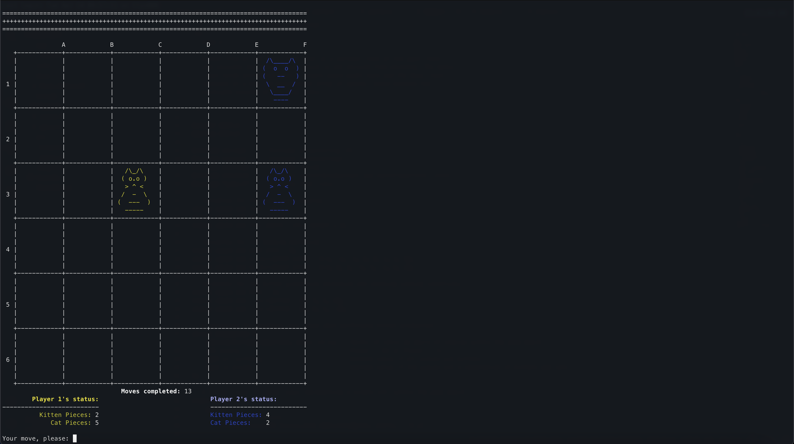
This is the results of player 1 graduating a mix of kittens and cats in cells A3, B2, and C1 (diagonally). Notice how player 1 now has 3 cats added to their pool where the cat on the board was put back into the pool since it is already a cat and the kittens are removed and 2 cats are pulled from the reserve.

### Kitten Selection
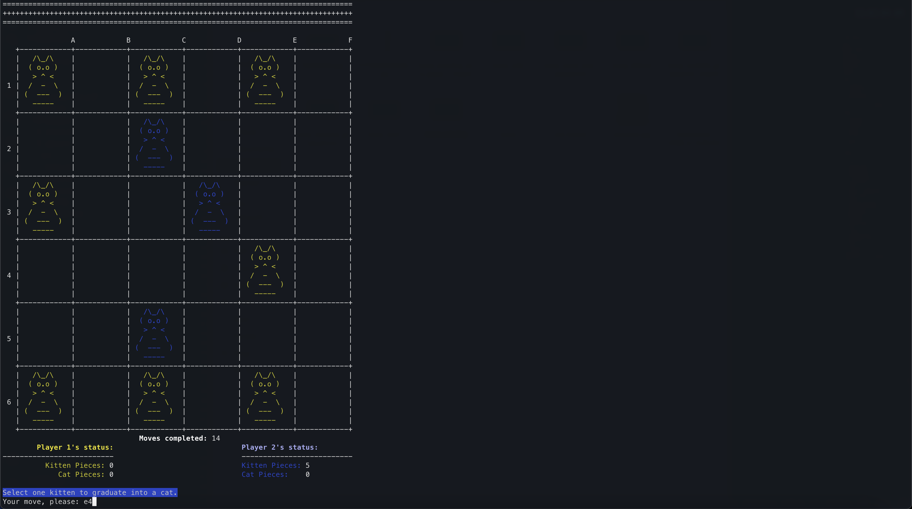
It is possible for a player to place all their 8 kittens on the board without lining any of them. In this case, the game will prompt the player to select any one of their kittens into a cat. Note that the player **cannot** select one of their opponent's pieces nor an empty space. In this example, player 1 has all 8 kittens on the board and selects their kitten in cell E4.

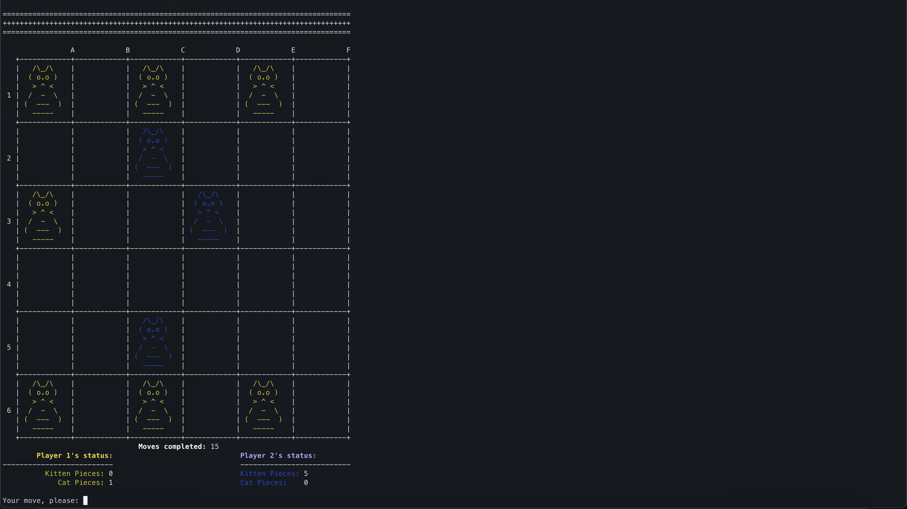
This is the results of player 1 selecting the kitten to graduate into a cat. The kitten is permanately removed from the game and a cat is put into the active pool from the reserve. Recall that each player **always** has 8 active pieces. After this event, it is the opponent's turn to place their upcoming piece.

### Multiple or Overlapping 3's for Graduation 
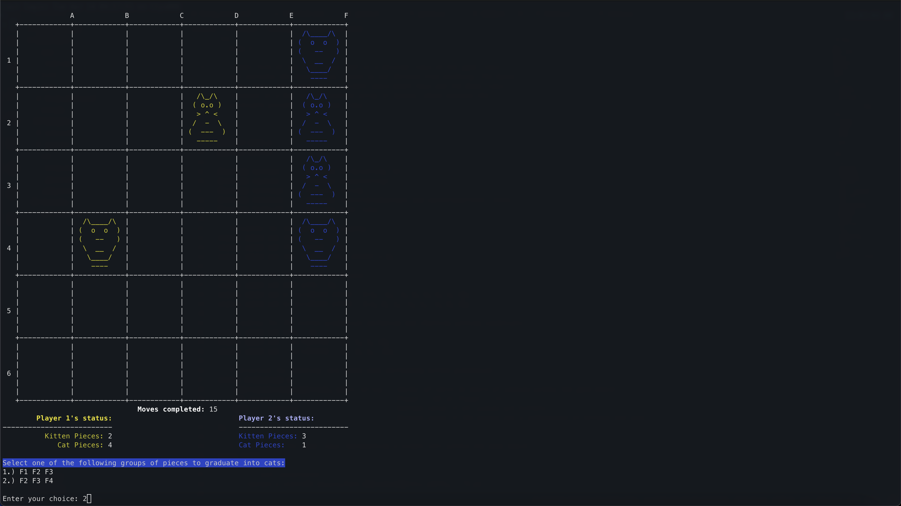
Sometimes, you may end up in a situation where there are multiple or overlapping groups of 3 pieces. In this case, the game will display a list of all groups of 3's to graduate into cats and you must input your choice. For example, player 2 has two overlapping groups of 3 pieces to graduate from cells F1 to F4 and is given two options to graduate.

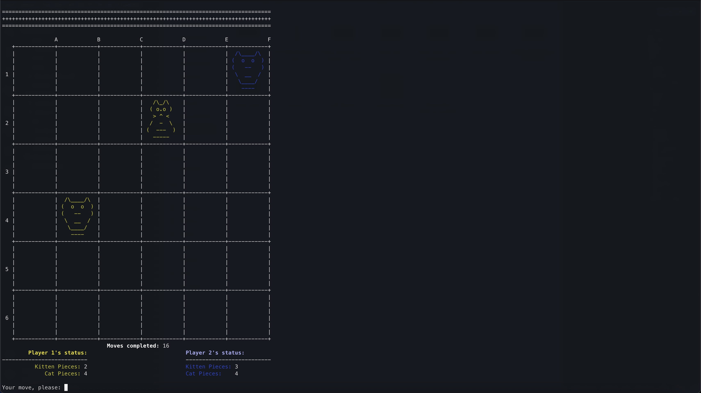
This is the result of player 2 choosing the second option, meaning that the pieces in cells F2, F3, and F4 are graduated into cats (Cell F4 contains a cat, so kitten graduation is skipped for this particular piece and is placed back into player 2's pool).


### Choosing to Graduate a 3-in-a-Row or Select a Kitten
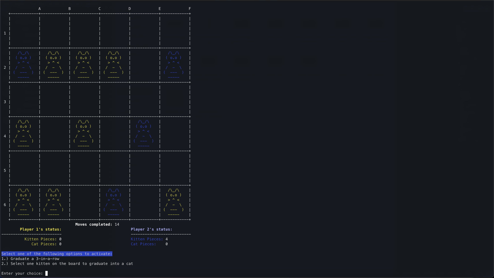
A **rare case** will occur when a player has all 8 kittens on the board **AND** there are 3 pieces in line. For example, player 1 has all their kittens placed on the board, but there's also a group of 3 pieces to graduate. Therefore, the player is given two option: graduate a 3-in-a-row or select a kitten to graduate into a cat.

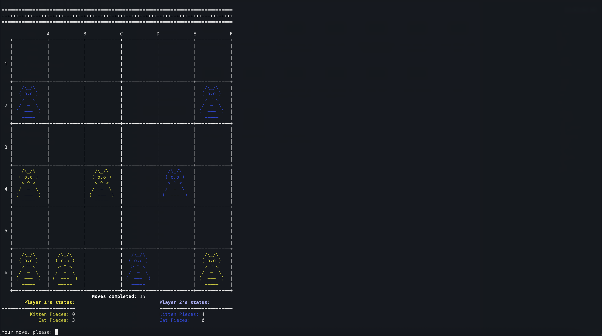
This is the results of player 1 selecting the first option, which is to graduate their kittens in cells B2, C2, and D2 into cats.


### Winning the Game
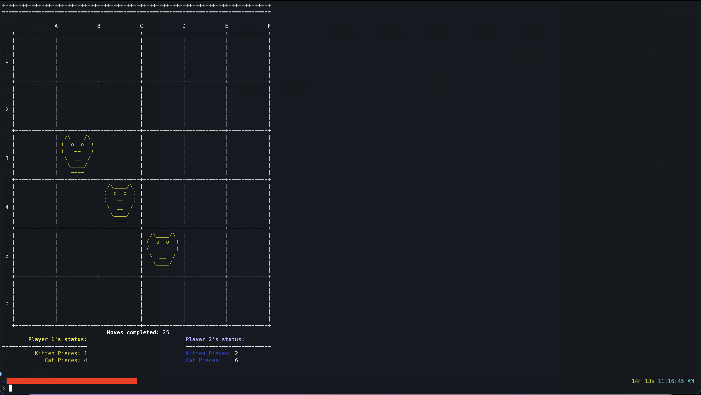
A player wins the game by **lining up 3 of their cats** in a **row**, **horizontally**, 
**vertically**, or **diagonally**. **Alternatively**, a player can win by **having all 8 of their cats on the board**. In this example, the game is over when player 1 has three cats diagonally lined up in cells B3, C4, and D5.


## Concepts & Learning Goals
* Object-Oriented Programming (OOP) in C++
* Game loop design and state management
* Board representation and data structures
* Algorithmic thinking
* Clean, modular code organization

## Known Issues/TODO
* Implement an AI opponent
* Develop test cases
* Display the winner of the game
* Fix issue where a player has no pieces left in their supply and all of their active pieces (kittens **AND** cats) are already on the board
* Fix issue where a player is given options to graduate when there are multiple graduations and they can graduate a group of the opponent's pieces

## Acknowledgements
* Original *boop.* game designers for the game concept
* Developers at Ohio Univeristy for the base version of the class Game files
